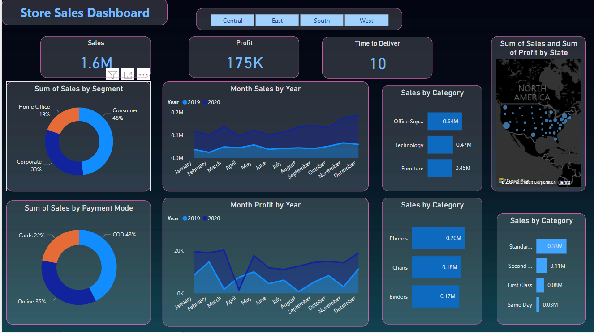

# Sales-Analysis
**Objective:**

The main objective of this sales analysis project appears to be to assess and visualize the sales performance of a business across different regions, categories, segments, and periods using Power BI. This analysis aims to identify key trends, performance by category, and the effectiveness of different sales strategies, including payment modes and shipping types.

**Data Content:**

- **Row ID+O6G3A1:R6:** A unique identifier for each row, possibly indicating a combination of row ID and additional data.
- **Order ID**: Unique identifier for each order.
- **Order Date:** The date on which the order was placed.
- **Ship Date:** The date on which the order was shipped.
- **Ship Mode:** The mode of shipping used for the delivery of the order (e.g., Standard Class, First Class).
- **Customer ID:** Unique identifier for each customer.
- **Customer Name:** Name of the customer.
- **Segment:** The market segment to which the customer belongs (e.g., Corporate, Consumer).
- **Country:** The country where the sale occurred, in this case, all being United States.
- **City:** The city where the sale occurred.
- **State:** The state where the sale occurred.
- **Postal Code:** The postal code for the location of the sale.
- **Region:** The geographical region of the sale.
- **Category:** The category of the product sold (e.g., Furniture, Technology, Office Supplies).
- **Sub-Category:** The sub-category of the product sold (e.g., Bookcases, Phones, Storage, Accessories).
- **Product Name:** The name of the product sold.
- **Sales:** The sales amount for the order.
- **Quantity:** The quantity of the product sold in the order.
- **Profit:** The profit made from the order.
- **Returns:** This column seems to be intended for data on returns but is empty in the displayed rows.
- **Payment Mode:** The mode of payment used for the order (e.g., Online, Cards).
- **ind1, ind2:** These columns appear to be indices or placeholders for additional data but are empty in the displayed rows.

### Glimpse of my Dashboard:

  

